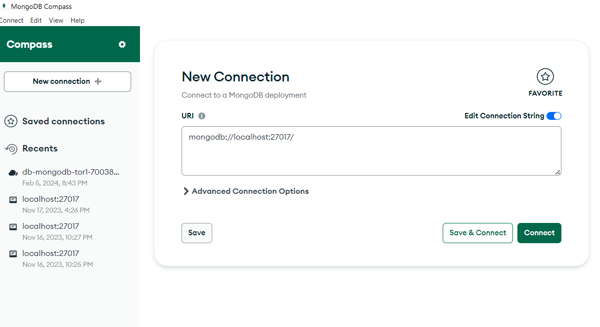
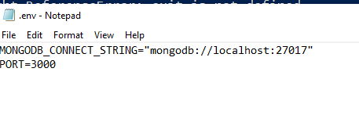

# Soysauce Setup Guide

## Firstly, clone this repository or download as zip and unzip it.

## Contents (The General Steps To Take)
- Getting the question data
- Database server setup
- Backend server setup
- Extension setup

## Question Data
- From your downloaded repository, find `questiosn.zip`. Or Download the database dump files here: [QuestionsDB](https://github.com/C20H12/Soysauce/raw/main/questions.zip)
- Unzip the file


## Database Server
### Things to download
1. Download the [MongoDB Server](https://www.mongodb.com/try/download/community)
1. Follow the installer and install the server and MongoDB Compass.
1. Download the [MongoDB CLI tools ](https://www.mongodb.com/try/download/database-tools)
1. Unzip the file. It is recommended to extract the folder contained to the same folder the server was installed in, which by default is `C:\Program Files\MongoDB\`.
1. You can add the tools to the system's PATH environment variable, but it is not required.

### Start the server
1. Navigate to `C:\` and create a folder named `data`, then create a folder named `db` inside.
1. Now you are ready to initiate the server. Navigate to `C:\Program Files\MongoDB\Server\7.0\bin\` and run `mongod.exe`. The output window should stay open, and connecting via MongoDB Compass should result in no errors. If that is not the case, check if step 1 is done correctly.
1. If you close the output window, `mongod` will be terminated and the server will stop running. To keep the server alive, we can enable the MongoDB service. Open Windows Services and find the MongoDB Server task that should be created for you. Right click on it and select "start".
1. Try connecting to the database via MongoDB Compass. It should succeed without errors.  

Created folder

`mongod` running

Compass connect and connected screens


Service


### Import the questions data
1. Open an instance of a shell, run the following command. If you did not add the tools to the system's PATH, you would need the full path to mongorestore. Change the port to your port if it is modified.
```
mongorestore --uri "mongodb://localhost:27017" "<Yout_Path>\Soysauce-main\questions"
```
2. A success message should display, stating that the documents are imported. You can use MongoDB Compass to check if the database "questions" exists and its sub folders are populated.

## Backend Server
1. Install NodeJS runtime.
1. Open a shell inside the `back` directory of this repository. Run the command: `npm i` to install all the packages.
1. Inside the `back` directory, create a `.env` file. Inside, it should hold 2 values, the database connection string and the port. `MONGODB_CONNECT_STRING`, `PORT`.
1. Run `node index.js`, a message should appear saying that the server is running on your defined port.



## Extension
1. Navigate to `<Yout_Path>\Soysauce-main\extension\scripts`, edit `url.js`.
2. Modify the variable inside to be your actual backend URL. The content within the file should look like this.
```
const BACKEND_URL = "http://localhost:<port>";
```
3. Finally, open up Chrome or Edge, go to the extensions management page, enable developer mode, and "load unpacked". Choose the `<Yout_Path>\Soysauce-main\extension` folder.